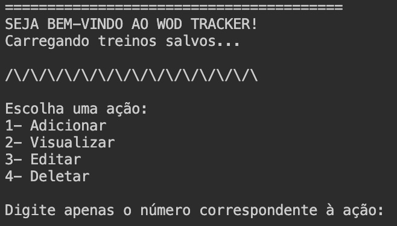
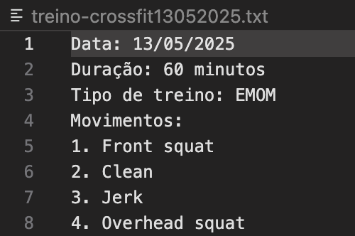

# 📄 **MANUAL DO USUÁRIO**  

## 🏋️ WOD Tracker

WOD Tracker é um sistema completo que permite o usuário registrar todos os seus treinos de Crossfit e planejar seus desafios futuros dentro do box.

### Pré-requisitos do sistema

- Baixar o [Python](https://www.python.org)

## ⚙️ Funções do sistema

### 1. 📲 CRUD de treinos

Função que permite o usuário registrar seus treinos novos -utilizando informações como data, tempo de duração, tipo e movimentos realizados-, editá-los, deletá-los ou apenas visualizá-los.

Quando o programa é iniciado, o sistema busca os arquivos de treinos já existentes no diretório do usuário.

*Tela de carregamento e opções do CRUD.*

#### Como funciona o CRUD

1. **Adicionar**: o usuário escolhe a opção 1, assim,  o sistema pedirá para digitar a data do treino e, com isso, criará um arquivo com nome contendo a data digitada. Em seguida, pedirá os outros dados: tempo de duração, tipo de treino e movimentos feitos.

    

2. **Visualizar**: o usuário escolhe a opção 2, assim, o sistema pedirá para selecionar entre as opções de filtro:
    - Todo o histórico;
    - Por nome do arquivo;
    - Por tipo de treino;
    - Por movimento.

    Dependendo do filtro, o sistema mostrará uma lista de arquivos filtrados ou o arquivo específico escolhido.

3. **Editar**: o usuário escolhe a opção 3, assim, o sistema pedirá para digitar o arquivo a ser editado. Então, deve-se escolher entre as opções de edição (o que está errado e deve ser editado):
    - Data (muda dentro do arquivo e no nome dele);
    - Tempo de duração;
    - Tipo de treino;
    - Movimentos.

    Em seguida, o sistema pedirá para o usuário digitar a correção (o que substituirá o elemento errado). Enfim, o sistema atualizará o arquivo de acordo com a escolha.

4. **Deletar**: o usuário escolhe a opção 4, assim, o sistema mostrará uma lista com todos os arquivos que já existem e pedirá que seja digitado o escolhido para excluir.

### 2. 🔬 Filtrar Treinos Salvos

O WOD Tracker permite que você filtre os treinos salvos de acordo com três ccritérios principais:
- **Tipo de Treino** (ex.: AMRAP, EMOM, For Time)
- **Movimento** (ex.: Agachamento, Burpee)
- **Data do Treino** (ex.: 16 05 2025)
  
#### Como usar o filtro

Passo a passo:

1 . No menu principal, escolha a opção **Visualizar** (digitando 2)

2. Quando solicitado para escolher o filtro, selecione uma das opções que utilizam a função de filtragem (opções 3 ou 4, ambas chamam a função de filtragem).

3. Você verá um formulário pedindo para informar os filtros:

    - **Filtrar por tipo** : digite o tipo de treino que deseja buscar (exemplo: amrap).
Dica: Caso queira ignorar este filtro, basta pressionar **Enter** sem digitar nada.

    - **Filtrar por movimento** : digite o movimento que deseja buscar (exemplo: burpee).
Dica: Para não filtrar por movimento, pressione **Enter**.

    - **Filtrar por data**: digite a data no formato dd mm aaaa (exemplo: 16 05 2025).
Dica: Para ignorar a data, pressione **Enter**.

Após preencher os filtros desejados, o sistema fará a busca e exibirá os treinos que correspondem a todos os **filtros preenchidos**.

Se quiser voltar ao menu principal após visualizar os resultados da filtragem, basta pressionar **Enter** quando solicitado.

### 3. 📁 Armazenamento de dados

Todas os treinos serão salvos em arquivos independentes no formato "treino-crossfitddmmaaaa.txt", permitindo a consulta do histórico a qualquer momento.

### 4. 🎯 Metas de desempenho

O usuário escolhe a opção 5, assim o sistema dará opções de ações, como:

- adicionar metas (opção 1);

- concluir metas (opção 2);

- acompanhar suas metas (opção 3)

Esse processo se repetirá quantas vezes ele quiser, até ele decidir sair (opção 4).

Caso ele escolha adicionar, o sistema vai perguntar quantas metas ele quer adicionar e quais serão essas metas, armazenando na lista de metas.

Caso ele escolha concluir, o sistema vai mostrar a lista de metas cadastradas e perguntar quantas metas ele concluiu e quais os números delas, de modo que as metas concluídas serão removidas da lista de metas em andamento e adicionadas a uma lista de metas concluidas.

Caso ele escolha acompanhar, o sistema retornará quais são suas metas em adamento e quais são as concluidas.

### 5. 🎲 Sugestões de WODs aleatórios

O sistema mostrará sugestões WODs aleatórios com base no histórico do usuário para manter os treinos variados.

### 6. 🎧 Sugestão de playlist

O usuário escolhe a opção 6, assim, o sistema pede para ele escolher uma das opções de humor apresentadas. Após sua escolha, será mostrada a playlist que melhor se adequa ao humor escolhido pelo usuário.

### Integrantes

| Nomes            | E-mail institucional |
| ---------------  | -------------------- |
| Beatriz Pedrosa  | [bfsp@cesar.school](bfsp@cesar.school)    |
| Louise Pessoa    | [lpams@cesar.school](lpams@cesar.school)  |
| Luísa Lócio      | [lbl2@cesar.school](lbl2@cesar.school)    |
| Marília Liz      | [mlal@cesar.school](mlal@cesar.school)    |
| Rebeca Ferraz    | [rrfn@cesar.school](rrfn@cesar.school)    |
| Sofia Avallone   | [sas@cesar.school](sas@cesar.school)    |

### ORIENTADORAS

| Nomes            | E-mail institucional |
| ---------------  | -------------------- |
| Ana Carolina Melo| [addm@cesar.school](accm4@cesar.school)   |
| Marcelo Arcoverde| [mla@cesar.school](mla@cesar.school)      |
